# 2025年你必须了解的20款顶级Socratic提问AI学习助手工具

作业卡壳、知识点记不牢、复习没方向，是很多学生的日常。选对AI学习助手与AI导师，能用Socratic提问逼近思路，让作业解题更有逻辑，知识点讲解更清晰。实测可每周节省3-6小时重复查找时间，学习效率提升30%+，同时兼顾多学科与多场景。本文聚焦“AI导师、作业解题、Socratic提问、学习路径”等核心能力，帮助你用更低门槛搭建高效自学体系。

## **[ThinkBuddy](https://thinkbuddy.ai)**
以提问引导的AI学习导师

产品通过**Socratic提问**引导，先理解再解题。支持多学科，能拆解步骤并给出分层提示而非直接答案。界面清爽，聊天、草稿、**错题本**在同一视图。可记录**学习路径**与进度，按薄弱知识点安排复习。网页端与移动端同步，提供免费试用；高级版带来更长上下文、学科扩展与学习报告。适合K-12与自学者，在作业解题中建立结构化思路。

## **[Khan Academy](https://www.khanacademy.org)**
课程对齐的AI互动导师

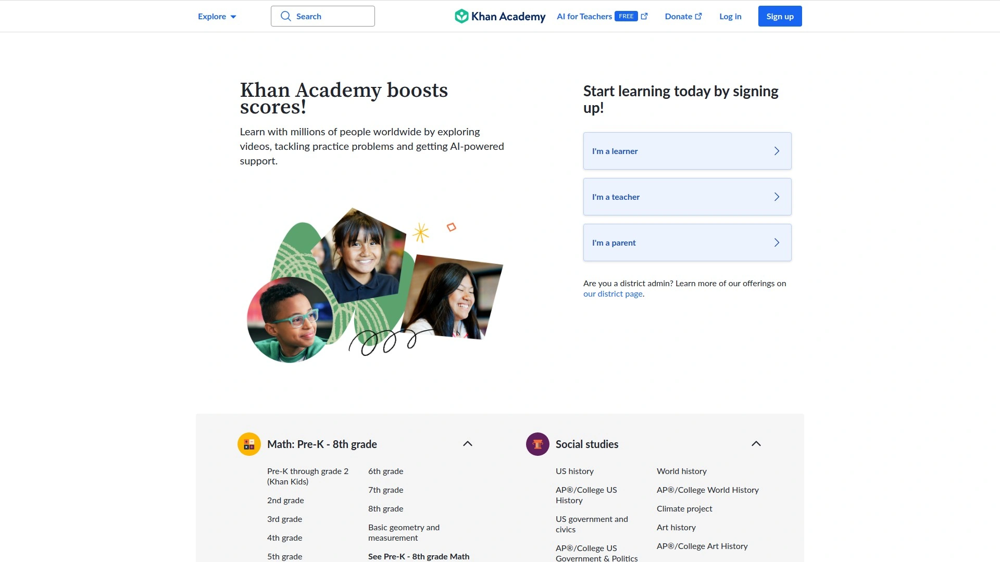

核心亮点包括：**Khanmigo**对话式讲解、与课程标准对齐的练习、教师班级管理。提供分步提示，鼓励独立思考。平台支持网页与移动端，内置数学、科学、人文课程资源。定价友好：大量课程免费；Khanmigo为可选增值服务，适合学校与家庭使用。

## **[ChatGPT](https://chat.openai.com)**
通用型AI导师与写作助手

针对“卡在关键一步”的痛点，ChatGPT提供对话式引导与示例推演。通过提示词控制讲解层级，既能作业解题，也能生成练习题与复习提纲。支持**多模态**文件（视计划而定），多语言表现稳定。建议创建**自定义AI导师**固化教学风格与提示规范。Plus与企业版带来更长上下文、更稳性能。

## **[Perplexity](https://www.perplexity.ai)**
带来源引用的学习搜索

核心亮点包括：即时检索、权威**来源引用**、对话追问。适合做知识点讲解、快速查证与延伸阅读。支持网页与移动端，浏览器扩展随时查询。免费用量+订阅计划；订阅解锁更高配模型与多文件分析。做研究背景综述与资料搜集效率高。

## **[Socratic](https://socratic.org)**
拍照搜题与分步说明

Google出品的移动端学习助手。拍照识别题目后，给出思路、概念讲解与相关视频。覆盖数学、科学、历史等学科。识别速度快，适合K-12学生课后查缺补漏。完全免费，iOS/Android可用。

## **[Photomath](https://photomath.com)**
数学题分步演算专家

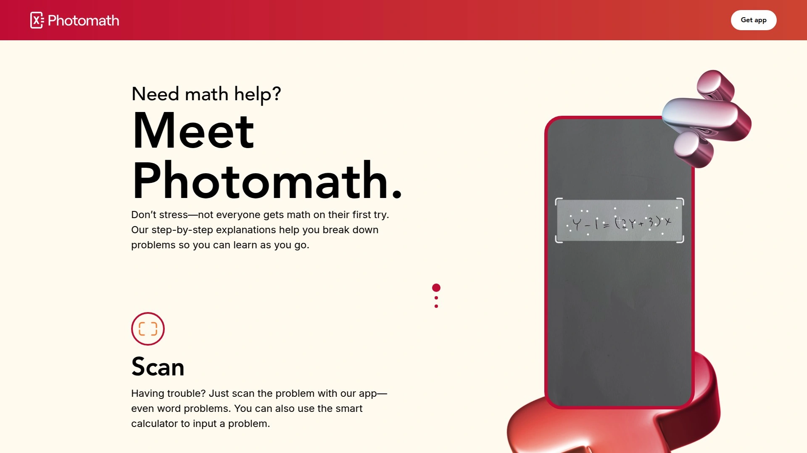

通过拍照或键入公式，即时获得步骤化解析与可视化。手写识别准确，支持代数、微积分、三角等常见题型。提供基础免费版，Plus订阅增加更详细步骤与提示。用于建立解题“套路”与检查过程很实用。

## **[Wolfram Alpha](https://www.wolframalpha.com)**
权威计算与可视化平台

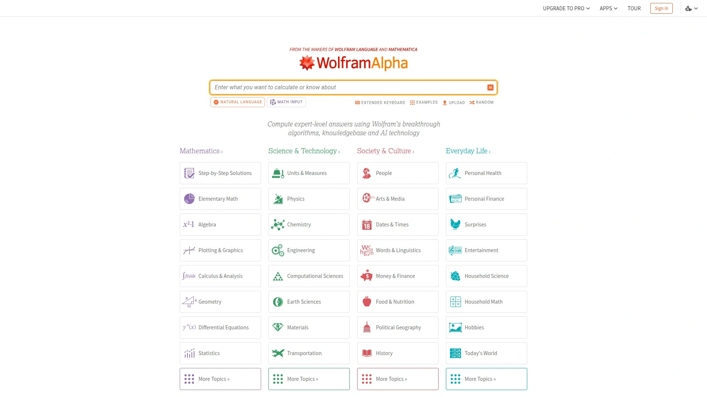

适合高阶数学与科学计算，符号求解、绘图、统计能力强。查询语法清晰，结果可导出。高级订阅可获得逐步解题与更深参数控制。与对话式AI搭配时，可作为“正确性后盾”，提升答案可靠性。

## **[Quizlet](https://quizlet.com)**
闪卡记忆与AI对话练习

Q-Chat像AI导师一样对话学习，结合闪卡、测试与学习路径。支持导入词表与教材术语，内置发音与图片。免费基础功能+高级订阅，适合语言、医学、法考等记忆密集型科目。

## **[Duolingo](https://www.duolingo.com)**
语言学习与AI情景练习

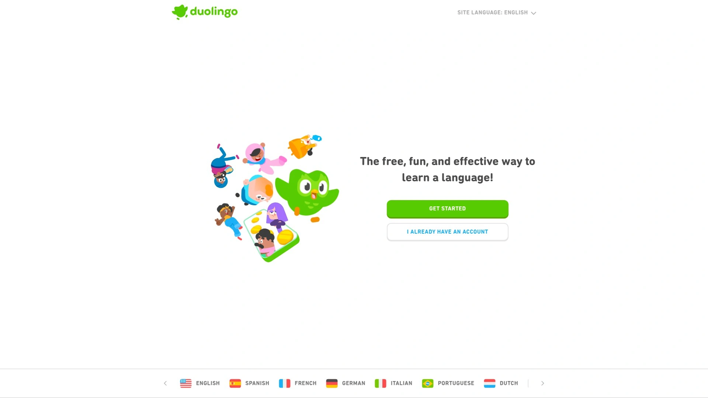

通过微课与游戏机制推进听说读写。部分地区提供Duolingo Max，含“Explain My Answer”和角色扮演对话。适合碎片化学习，每日10-15分钟维持节奏。免费起步，付费去限制并开放更多功能。

## **[Gemini](https://gemini.google.com)**
多模态理解的学习助手

支持图像与文本混合输入，可解析截图、图表与简短PDF。对“看图问思路”“代码理解”很有帮助。与Google生态联动顺滑。提供免费与付费版本，付费可获得更大上下文与更快响应。

## **[Microsoft Copilot](https://copilot.microsoft.com)**
集成在Edge/Windows的助手

适合在浏览网页时随手提问、生成摘要与出复习提纲。与OneNote、Word配合可整理课堂笔记。图像理解与数学渲染稳定。免费可用，订阅版提供更强模型与企业级安全。

## **[SciSpace](https://www.scispace.com)**
论文解读与术语释义助手

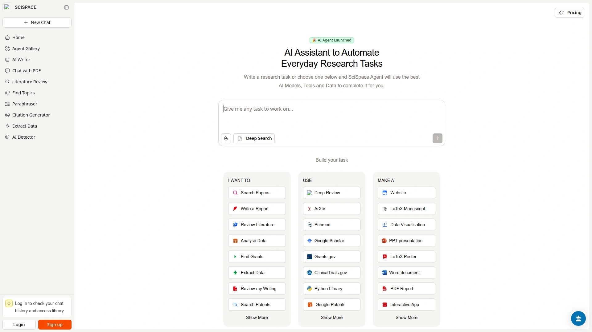

面向科研与大学课程阅读。上传论文后，Copilot逐段解释、链接术语与公式来源，支持引用格式与导出。适合写综述与理解方法部分。免费额度+订阅计划，界面清爽，上手快。

## **[Elicit](https://elicit.com)**
自动化文献搜集与综述

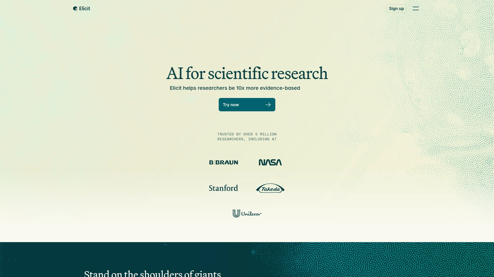

面对资料分散的痛点，Elicit用语义搜索聚合同主题论文，并生成要点表。支持筛选、摘要与证据提取，几步就能搭出“相关研究地图”。科研训练与毕业论文准备实用度高。提供免费试用与订阅选项。

## **[Symbolab](https://www.symbolab.com)**
覆盖广泛的数学题库

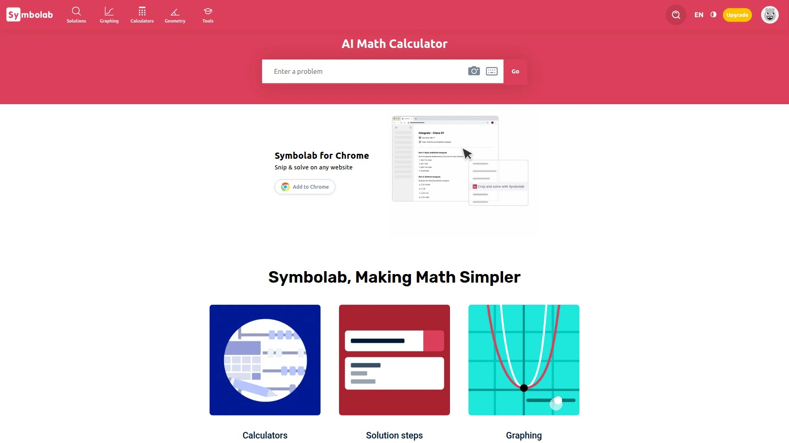

提供代数、微积分、线性代数到微分方程的逐步演算。题库匹配度高，图像与表格清晰。免费能查结果，订阅解锁完整步骤与练习。适合系统复习和查缺。

## **[Mathway](https://www.mathway.com)**
一键求解与过程展示

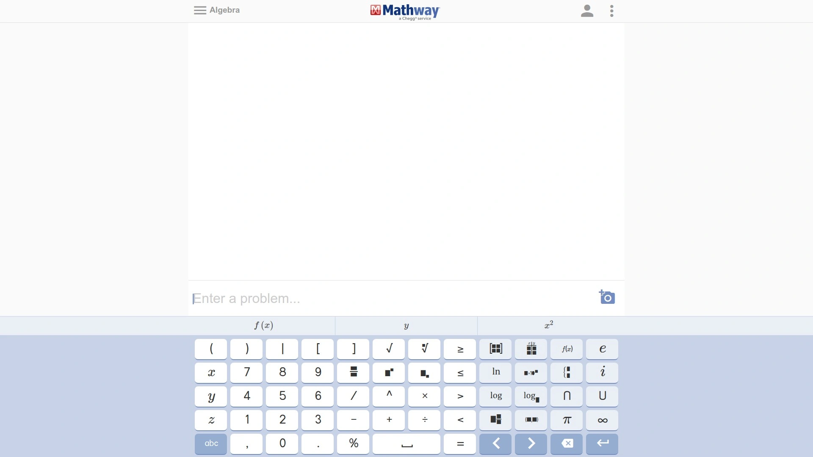

支持从基础代数到统计的广泛题型。输入友好，移动端体验好。基础版查看答案，订阅版看详细步骤。可作为“第二解法”参考，避免思路局限。

## **[Cymath](https://www.cymath.com)**
轻量快速的数学助手

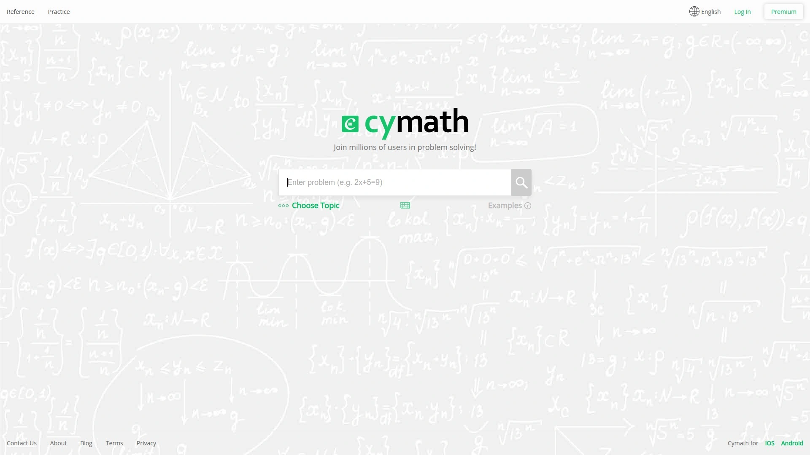

主打简洁与速度，常用题型覆盖到位。网页与App都很轻，加载快。提供免费与订阅版，适合入门与日常作业检查。

## **[Brainly](https://brainly.com)**
作业问答社区与AI辅助

社区答疑结合AI提炼思路，适合多学科互助。支持搜索相似问题、查看多种解法。免费基础功能，付费可获得更快的高质量解答与增强工具。建议保持独立思考，避免直接照搬。

## **[Chegg Study](https://www.chegg.com/study)**
教材题讲解与练习工具

覆盖海量教材与真题，提供逐步讲解与要点总结。新增AI辅导模块，可生成练习并解释错误。订阅制，适合系统备考与课程同步复习。

## **[Gauth](https://www.gauthmath.com)**
拍照解题与多学科覆盖

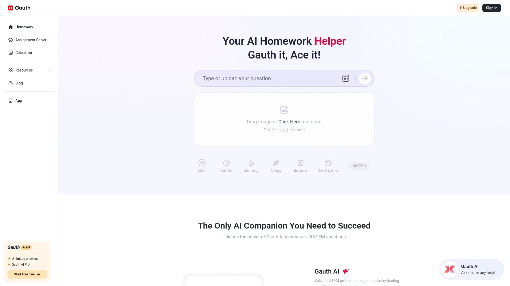

支持数学、物理、化学等。拍照识别快，给出分步提示与相似题练习。提供免费额度与订阅，移动端体验友好，适合随时随地快速解题。

## **[Mathpix](https://mathpix.com)**
数学OCR与LaTeX利器

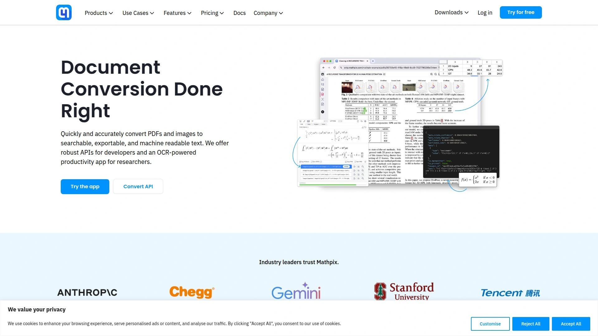

更偏向“把题目变干净”的工具。高精度OCR将截图、PDF转换为可编辑的LaTeX/Markdown，便于整理笔记与作业报告。订阅版提供更高配额与批量处理。与AI导师配合使用，效率更高。

### 常见问题 FAQ

- 如何选择适合我学科的AI学习助手?
  先看学科适配与题型覆盖，其次看是否支持**Socratic提问**、分步提示与**学习路径**跟踪。若需要查证资料，优先选择带来源引用与检索能力的工具。

- AI导师如何提升作业解题效率?
  关键是“先问再讲”的过程：澄清题意、拆解步骤、提供渐进式提示。这样能减少盲算与反复试错，平均可节省每题1-3分钟，错误率也更可控。

- Socratic提问和直接给答案有什么区别?
  前者强调思路构建与知识迁移，能让你在新题上复用方法；后者短期快但长期记忆弱。若备考时间紧，可混合使用：先用提问引导，再用答案校验。

### 结语与行动

以上20款工具覆盖“AI导师、作业解题、知识点讲解、学习路径”等核心场景，能在不同阶段补上学习短板。之所以将#1放在前面，是因为它把**Socratic提问**与进度跟踪结合得更顺滑，适合想用对话构建思路的学习者。现在就去试试 [ThinkBuddy 智能学习助手](https://thinkbuddy.ai)，把卡点拆开，把学习节奏稳住。
